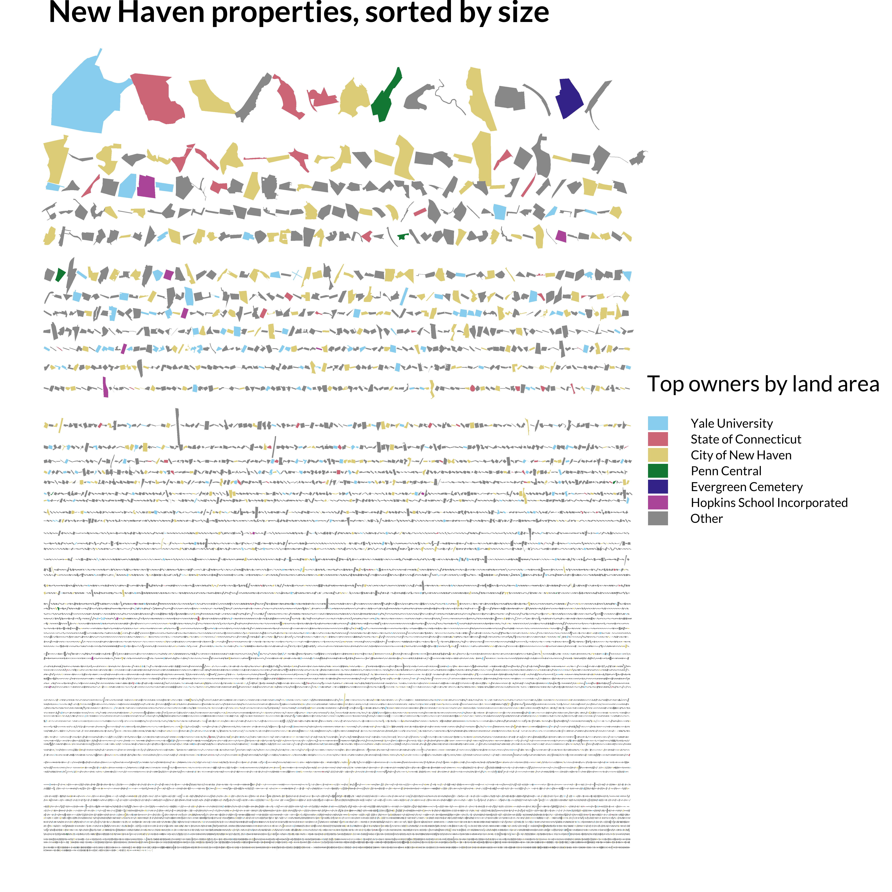

This is a "map" of New Haven properties sorted by size. This has some aesthetic appeal and interesting stories around land ownership that I've tried to bring out through selective highlighting, for instance showing that the largest property in New Haven is the Yale Golf Course. 

This stretches a bit beyond the traditional definitions of a "map," though. A map is usually useful for adding context to geographic features of interest, but this map does the complete opposite by removing physical objects from any sort of context and even making all but a select few unrecognizable.

This was also a bit of a puzzle to code in R. I used the `sf` package in R to manipulate the building geometries from their original locations into a grid setup, using lag functions to adjust their x- and y-coordinates based on the previous building that was placed. This requires some tweaking -- you might notice that some buildings overlap -- but it's good enough for one day's work. 
