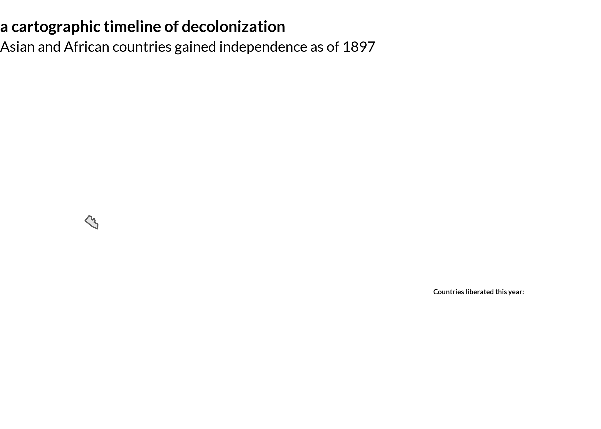

This past winter break, I made a few maps inspired by the [30 day map challenge](https://github.com/tjukanovt/30DayMapChallenge). This is one of them, responding to the prompt of "yellow." The maps in response to the challenge aren't too polished or meaningful, but they were a fun chance to quickly create things and try to learn some new technical skills. 

The prompt of "yellow" was pretty difficult to come up with a response to. Yellow is a pretty uncommon color, and also tends to overpower or clash with lots of colors. 

My response is a map with the theme of "yellow peril supports Black power," a slogan first associated with the racial justice movement of the late 1960s. One way this movement differed from the earlier Civil Rights Movement is in its scope; it was much broader, aiming to rewrite not only the law that defined race and racism but also the essential category of the human that the law and many other constructs are written over. The scope of the movement was also profoundly international, coming at a moment when many Third World nations had newly "received" their independence or were fighting to obtain it. Movements like the Third World Liberation Front consciously identified themselves with these international struggles ("Third World Liberation Front" being a homage to the Algerian National Liberation Front, the National Liberation Front for South Vietnam, and many others), and saw their pursuit of decolonial curriculum and material rights to safety at home as acts of self-determination on the same spectrum as the fight for decolonization abroad.

This GIF is my one-day attempt to show the process of decolonization through the 20th century. I scraped Wikipedia for decolonization dates and used the `maptools` package in R for the country shapefiles. I tried to show self-determination as an act of speaking a nation into existence. At one point there was no nation, instead there being a colony excluded from the community of nation-states, and then paradoxically after decades of struggle the nation is made instantaneously into existence. 

More so than any other map I've made for this project, I think this one deserves criticism. Firstly, it's just messy. There are countries that don't neatly fit a single date of "independence" from an imperial power. Korea is a good example: in 1945 Korea was liberated, but were immediately  and arbitrarily divided according to the whim of two military officials from the new imperial power of the U.S. South Asia is another good example, where the British Empire's rule over India ended in 1947, but Bangladesh did not receive independence from Pakistan until a few years after. On some level this is a fundamental issue that nations cannot adhere to a single rule or a single appearance, but in future work I hope to just clean this figure up and work with a better set of rules to make it look nicer. 

Secondly, the map seems only to suggest that the nations pop into existence suddenly, and does not show how sudden independence nearly always came after years and years of slow struggle. This can also be worked on by tweaking the transparency of states up to the year of liberation. 
