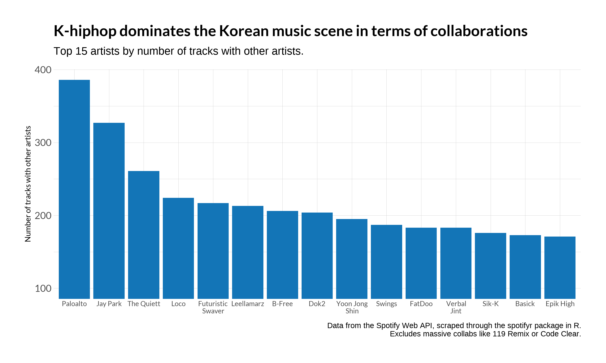

This past winter break, I made a few maps inspired by the [30 day map challenge](https://github.com/tjukanovt/30DayMapChallenge). This is one of them, responding to the prompt of "non-geographic map." The maps in response to the challenge aren't too polished or meaningful, but they were a fun chance to quickly create things and try to learn some new technical skills. 

The final map I made this month took me two weeks to make and is still not exactly perfect, but it's overall one I'm happy with and that I learned a lot in creating. A preview is shown in the image below, and the full interactive map can be found at [korean-music-map.info](https://korean-music-map.info). All of the code I used to create this can be found at [github.com/18kimn/spotify_features](https://github.com/18kimn/spotify_features). If you're interested in this project and want to talk more, you can email me (nathan [dot] kim [at] yale [dot] edu) or we can talk on Twitter (@nathanckim).

This map is a non-geographic map of Korean musicians. I scraped the dicography of every Korean artist on Spotify through their Web API[^1], then spent a while learning the D3 library in JavaScript to build an interactive plot that is somewhere between a network diagram, a scatter plot, and a map. 

<iframe src= "https://korean-music-map.info//" width="90%" height=800 style={border: 0;}></iframe>
 
<a href=https://korean-music-map.info> To view the full visualization, click here.</a>

## Basic info

Each circle represents one artist, and color represents the main genre that Spotify lists this artist under (blue means K-indie, orange means K-hiphop, green means K-pop, and red means Korean r&b). The size of each circle represents popularity, which I adjusted to show more contrast between bigger and smaller artists, and standardized across genres so that K-pop (the most popular genre by far) wouldn't make artists in other genres appear much smaller. Zoom in and out by scrolling with your mouse. Clicking any circle reveals some basic information about the artist and reveals lines between them and other artists, which represent collaborations through music. Artists that are closer together on the visualization are closer together in musical "space" by making music together or by having many mutual collaborators between them.

The outer set of circles are artists with few or no connections, such that they aren't embedded within the chaotic space in the center. A few really well-known music groups like TxT and BlackPink are in this outer ring; they mostly collab with non-Korean musicians or perform by themselves. 

## Some thoughts on the map

#### Motivations

As I stated [before](https://nathankim.name/projects/map_month/7_newtool/), I've become a huge fan of Korean music over the past few months, especially Korean R&B, Korean hip-hop, and Korean indie. There's something super exciting about seeing artistic expression of any kind, and especially if artists try new genres or push on societal standards. Korean music has come a long way in the past twenty or even past ten years, with one result being a huge growth in diversity of genre. 

This map is an attempt to represent that diversity in Korean music. As much as I am a fan of BTS and BigBang, I often feel that pop musicians under large companies are able to succeed internationally because of giant marketing campaigns, connections made to other media sectors like advertisements and TV shows, and of course years of training made by the investment of their company. Again, this is in no way a criticism of successful pop groups and idols, many of whom I listen to on a daily basis. I only wanted to show that Korean music is so much more diverse than what the forces of capital might have us believe. 

The other inspiration for this map was from working through Spotify's recommendations. I realized after a few months that as "smart" and surprisingly insightful Spotify's algorithms might be, the way recommendations are made kind of separates the song from the artist and prevents exploration of artists as *people* -- people with professional connections and intimate friendships with other artists, people whose music change over time, people who spend time and thought to the order of songs on their album. In the Spotify app, you can't search for featurings an artist did, or find how their listenership changed over time; songs are packaged in vibe- and genre-specific playlists that are useful but limited. I made this map partly to emphasize this paradigm of artists as people, and in turn of music as a dynamic social space with movement, attraction, repulsion, and connections. 

#### What I learned

A major takeaway that I had after creating this map was that hip-hop musicians have the most amount of collaborations by far, and pop musicians have the least amount of collaborations by far. Here's a simple bar graph I made from the data I was working with to show this; nearly all of the top 15 collaborators in Korean music are from Korean hip-hop. This makes sense, there's lots of famous collaborations in American hip-hop too, and in Korean hip-hop some of the most famous tracks are mega-collaborations like [119 Remix](https://open.spotify.com/track/6Y0VCyjVZ7waMVgDMJffu4?si=nr1eegHCRgeAH4vfVeOgpA) or [Code Clear](https://open.spotify.com/track/6Mf7T0kJOuxTop2AE9L0Sc?si=6K-B7-LVShefHn8wfGeISA). Hip-hop musicians also tend to stay hyper-active in music longer than Korean pop musicians (many of the artists in the plot below are in their mid-30s). 

The second, more abstract takeaway I had while creating this map was that while there is no way to represent space (or any concept) completely or "accurately," it's still very useful to try. To make a "map", I felt that I needed to represent space; I had no idea how to do so given that longitude/latitude coordinates aren't part of Spotify's data. I instead used force simulations from the D3 library in JS, visually representing social connections as spatial ones via distance and lines. Although horizontal and vertical scales don't mean anything specific on this map as a result, to me this map still represents space -- a complex set of interactions together, where concepts of "near" and "far" can be seen, where movement can be understood. 

#### About coding 

This was my first time touching D3, and my extent of working with HTML and CSS was limited to styling R-based Shiny applets.[^2] I learned so much at every step, and every step was at least mildly frustrating. Here are a few highlights: 

1. **[The data-join and selection paradigms.](https://bost.ocks.org/mike/join/)** I love the ggplot2 ecosytem for data visualizations in R for many reasons; one of the biggest is that there is a coherent logic to guide it all. If you don't know how to make a type of chart, there's no need to worry, because the process to create it is exactly like pretty much every other type of chart with one change. There are parts you can name (grobs, geoms, themes) that might take some time to get used to, but ultimately they help simplify code and save time. When I began making this map, I immediately looked for the same logic in D3, but this was much more difficult because concepts in D3 were just less intuitive and because they depend on ideas familiar to web developers but unfamiliar to me (the DOM, how JSON data is structured). The data-join and selection paradigms are some of these concepts that I still have difficulty understanding and I will probably have to relearn at some point in the future, but I am glad overall to have grasped enough to build this map.
2. **Styling**. D3 has lots of pre-built structure that help make beautiful graphics (color scales, force functions for movement, transitions), but styling still represented a challenge for me in this project. Setting fonts, making some text clickable, positioning the title in the right spot, making two columns and four rows for the node tooltip, and so on all took me a few hours on and off to make right. 
3. **Line positions**. I solved an SAT-esque geometry question to stop lines from appearing inside of the circles, which I had found aesthetically unpleasant. It went a little bit like: 

> There are two circles A and B with centers at coordinates (5,3) and (1,0) respectively and radii 3 and 1 respectively. Imagine a line segment connecting the two centers. It passes through the edge of the circles exactly once for each circle. What are the coordinates of where this line meets the circles' edges?

My math skills are a bit rusty, but I eventually got this to work. 

4. **Scopes**. I mainly work in R, where the scopes of environments are pretty easy to work with. You make an object once, you can refer to it later in pretty much any context. Unless you're a developer in R, you probably don't have to worry about scopes, and even if you are, paradigms like `tidyeval` have been created to make these processes easy. But this concept became more difficult in JS given that *everything* was inside of a function -- because data is loaded asynchronously, it has to be loaded inside a specific `d3.json(function(data){...})` style call, and data can't be referred to outside of this environment. I learned how to make dummy variables in global environments and update them in specific functions to work around scope issues. 

## Limitations of the map

There are lots of things "wrong" about this plot, some of which will be improved in future iterations and others which I don't think I can improve by myself. Firstly, to improve performance I cut the amount of lines that would show on the map, which meant only representing each artists' top three collaborations. If an artist has more than three lines connecting to them, it means that work they are listed on were in *other* artists' top three collaborations. If an artist has less than two lines connecting to them, they either collborated with non-Korean musicians, Korean musicians that Spotify did not have data for, or did not collaborate with other musicians at all. The performance issue that led to this data limitation is something I hope to improve in future iterations of the map, perhaps after I gain more experience working with D3. 

Secondly, because Spotify only released in South Korea [this month](https://newsroom.spotify.com/2021-02-01/spotify-launches-in-south-korea/), the perspective shown here is an outsider's view that obscures as much as it shows. Jay Park and artists under his label H1GHR music (for example) might be inflated in node size compared to if listenership data from Korea were able to be incorporated, given their disproportionate popularity with international audiences. Even in a few months, when data from Korea is able to be accessed through the Spotify API, listenership will probably not be represented well given the Korean market is already saturated with other music streaming services like Genie and Melon, and some very popular Korean artists won't be hosted on Spotify Korea ([IU](https://hypebae.com/2021/2/spotify-korea-launch-without-iu-zico-monsta-x-kakao-m-k-pop-music-streaming-service-info) is one example). 

Thirdly, Spotify as a data source was incomplete in how it tracked artists' information. Producer credits, older artists, and label or company information were all missing from the Spotify API. Artists of course also publish music on Soundcloud (and in Korea, Genie and Melon as mentioned before), perform music once at a club and never give a full release, and so on -- Spotify is vastly incomplete. 

In the future, I'll revisit this project to update the data, work on performance enhancements, and add more features. For now, I think I have to do my reading responses and prepare for class. 

[^1]: and some modifications to the `spotifyr` package in R
[^2]: If that means nothing to you, don't worry about it.

