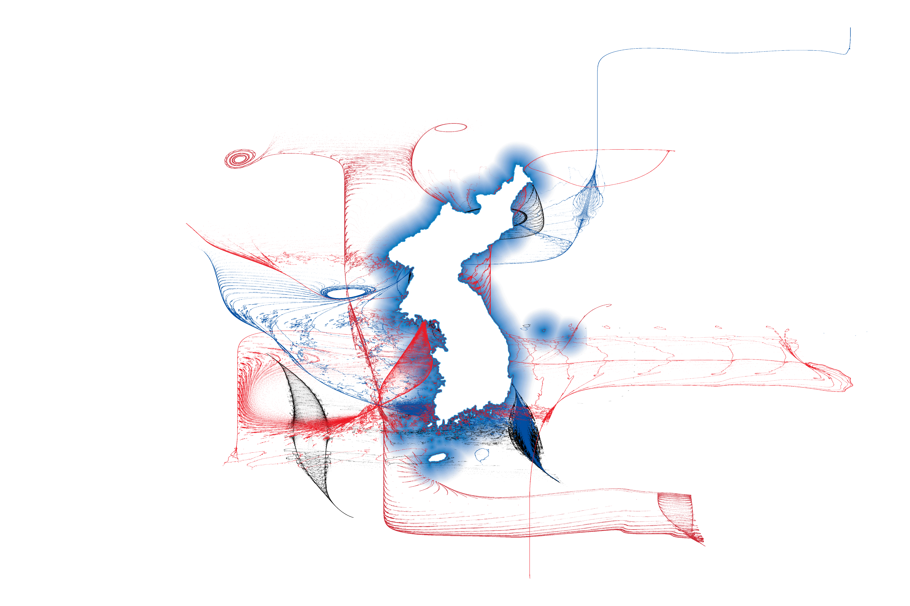

Korea was divided into two in 1945, when on August 15th (now "Liberation Day") Korea was released from the rule of the Japanese Empire. 

Korea was liberated from Japan through blood (over 20,000 Koreans died as a result of the bombings of Hiroshima and Nagasaki), and in the new state of "freedom" the South Korean government and the United States military prevented all efforts for unification and anti-imperialism. In the ten years after "freedom", 110,000 were killed in the Bodo League massacre, 30,000 were killed in the Jeju Island uprising while the remaining 40,000 fled to Japan, 90,000 men drafted by the Syngman Rhee regime died of starvation and disease in the National Defense Corps Incident, and 2,000 were killed in the Yeosu-Suncheon rebellion. In total, almost 25% of the Korean population were killed through the Korean War. 

Guns and death were one method of destruction. Others were the use of napalm and the U.S.' scorched earth policies to prevent recovery of the land, the continuous bombing of industrial targets on both sides of the 38th parallel by the U.S. government until no more "worthy" targets were left, and the continued subjugation of Korean women to sex slavery that had begun under the Japanese empire. 

It is impossible to convey the scale of imperial violence on a short blog post, and I hope not to normalize the bloodshed that is yet ongoing. I refer to the violence of the past to illustrate the violent history of the present, or to emphasize that the nation today is created through physical, psychological, cultural, and political destruction. 

I dream of Korea by seeing what it is not: I dream of unification by despairing at the ever-visible division, I dream of a national identity by seeing the ways this has been destroyed and rebuilt as capitalist necolony, I dream of peace by studying the ongonig violence.

The map here inverts the beautiful Korean reunification flag, a positivist vision of a unified nation often flown at sporting events as a symbolic gesture of sisterhood. Where the reunification flag uses a solid block of blue, I leave the nation completely white and use the blue to envelop the nation in a semitransparent shimmer. The colors of the ROK and DPRK flags are added in large spirals. Though these patterns were created through almost entirely random means through the [simplex](https://en.wikipedia.org/wiki/Simplex_noise) noise generating algorithm, some visual cues emerge that remind us of this nation's history. Bright red points fly out of the West side of Korea, almost like a spray of blood; at other points, the blue and black points combine to make almost a rocket flame to remind the viewer of the violent warheads that even today are brought to the penninsula through the U.S.' expansion of the THAAD "anti-missile" defense system. 

This map uses the [jasmines](https://github.com/djnavarro/jasmines) and [ambient](https://ambient.data-imaginist.com/) packages in R. Code is available upon request. For further reading, please see Grace Cho's *Haunting of the Korean Diaspora*. 

