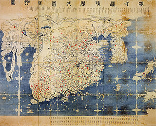
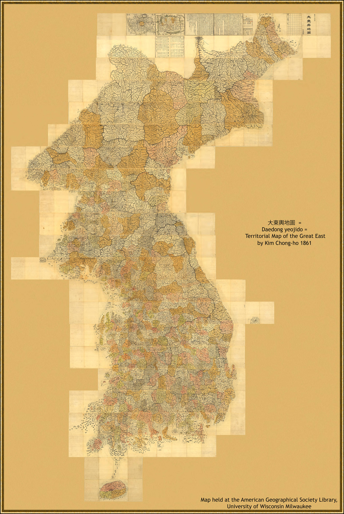
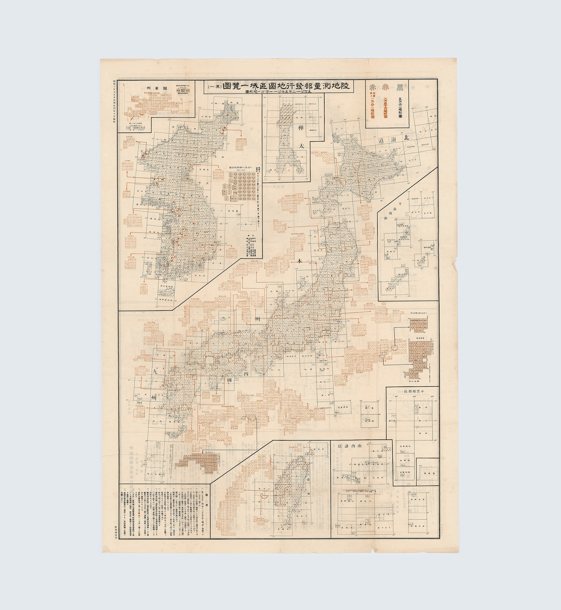
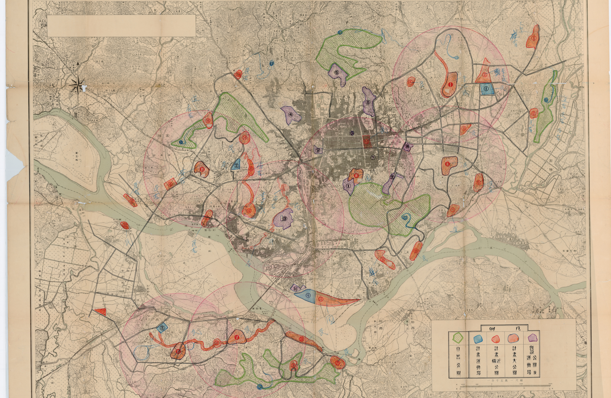
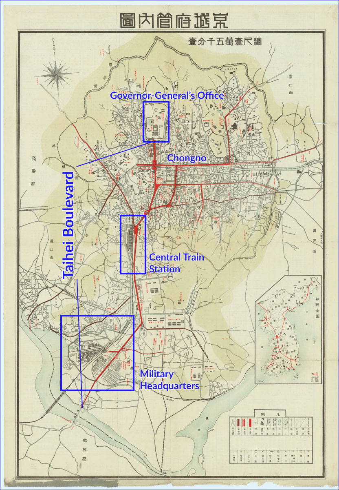
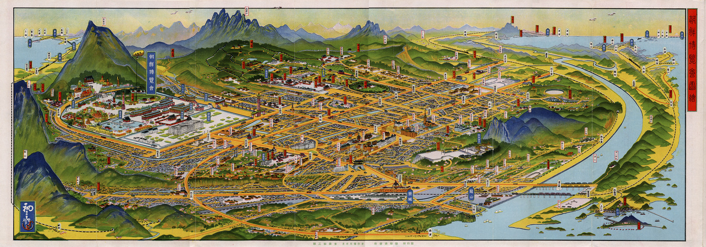
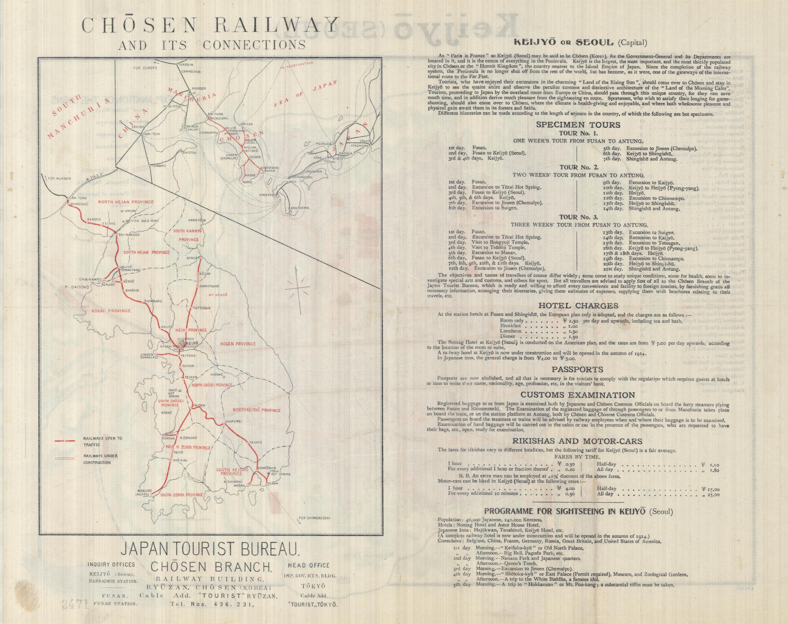

This is a school assignment, from my junior year of
undergrad. The course, _Cartography, Territory, and
Identity_ (taught by
[Bill Rankin](http://radicalcartography.net)), was fun and
challenging for me. Although the course was taught without
reference to the phrase "science and technology studies," I
see the critical study of maps from this course -- as texts
and technologies that had important cultural and
geopolitical meanings but which could not be taken at face
value (maps always tell only specific kind of truths) -- as
some of my first steps into STS. The perspectives from this
course also led into my work with the Anti-Eviction Mapping
Project.

Also, pretty obvious, but this was originally written on a
Word doc and I ported it over to markdown. I'm also doing
this in April 2025, four and a half years after I wrote the
thing. There are some inconsistencies I can't be bothered to
fix (like markdown in footnotes not working properly).

---

## Introduction

My project explores the transition in mapping brought forth
by the Japanese colonization of Korea. I begin with a set of
precolonial Korean and Japanese maps to contextualize
spatial knowledge before colonization, then discuss the Land
Survey Ordinance of 1910 as a marker for the shift in maps
as objects of modernization. Though the Ordinance proclaimed
a relatively narrow goal of clarifying arable land ownership
and collecting tax revenue, the Land Survey Bureau went
further in establishing a discursive backbone for cultural
products to emerge as well. These cultural aspects are
especially visible in Japanese maps of the later colonial
period, defined here as 1919-1945, and maps eventually
became tools for creating consent from Koreans.

A substantial amount of scholarship has already discussed
spatial knowledge in colonial Korea, mainly around how the
Japanese land survey redefined property rights or gave rise
to private landlords.^[ Edwin H. Gragert, _Landownership
Under Colonial Rule: Korea's Japanese Experience, 1900-1935_
(University of Hawaii Press, 1994); Young-Ho Lee, "Land
Reform and Colonial Land Legislation in Korea, 1894-1910,"
in _Colonial Administration and Land Reform in East Asia_,
ed. Sui-Wai Cheung (Routledge, 2017), 166--80; Gi-Wook Shin
and Michael Edson Robinson, _Colonial Modernity in Korea_
(Harvard Univ Asia Center, 1999). ] These definitions of
property are undoubtedly important to constructing space.
However, as I argue for the rest of my paper, the Japanese
project of spatial knowledge had a much broader scope than
structuring economic relations. Spatial knowledge also
served as an assimilationist tool. The products of spatial
knowledge conveyed ideology specific to Japanese
colonization and modernization, and served as a discursive
bridge between overtly oppressive coercion and
consent-generating cultural rule.

## Historical and cartographic context

Maps were not introduced to Korea with Japanese
colonization. Korea's cartographic tradition had prevailed
for several centuries before the annexation; the _Kangnido,_
a Korean world map shown in Figure 1, is one such example as
one of the oldest maps to come from East Asia and one of the
most famous examples of Korean cartography.[ Kenneth R.
Robinson, "Gavin Menzies, 1421, and the Ryūkoku Kangnido
World Map," _Ming Studies_ 2010, no. 61 (April 1, 2010):
56--70, https://doi.org/10.1179/014703710X12772211565945.]
The _Kangnido_ placed China at the center of its worldview,
with Europe and Africa in irregular shapes near the
left-hand side of the map. Japan is noticeably smaller than
Korea, which is visible as a distinct but still connected
part of the main continent of China. In addition to the
_Kangnido,_ maps from the early Joseon dynasty like the
circular _ch'onhado_ and the navy's _kwanbangdo_ maps
similarly de-emphasized a rigid scale in favor of other
purposes that were as diverse as translating folk tales or
in giving conceptual sketches of coastal forts.[ Gari
Ledyard, "Cartography in Korea," in _History of
Cartography_, by David Woodward and John Brian Harley, vol.
2, 2 (University of Chicago Press, 1994),
https://press.uchicago.edu/books/HOC/HOC_V2_B2/Volume2_Book2.html;
Han Young-Woo et al., _The Artistry of Early Korean
Cartography_ (University of Hawaii Press, 2008); John Rennie
Short, _Korea: A Cartographic History_ (University of
Chicago Press, 2012).]

**Figure 1. The _Kangnido_ World Map. From the National
Institute for Korean History.
<http://contents.history.go.kr/front/km/print.do?levelId=km_015_0060_0020_0010&whereStr=>**

Most celebrated of Korean maps are the works of 19^th^
century cartographer Kim Chon-Ho, known foremost for his
1861 map of Korea titled "Detailed Map of the Great East"
(Figure 2). At a scale of 1:162,000, and stretching 6.7
meters by 3.8 meters, this was the most detailed map of the
peninsula to exist at the time of its publication. In the
words of the Seoul Museum of History, for this level of
detail, the map is "generally regarded as the greatest
cartographic achievement before the modern era."[ "Detailed
Map of Korea (Daedongnyeojido), Woodblock" NATIONAL MUSEUM
OF KOREA, accessed December 18, 2020,
https%3A%2F%2Fwww.museum.go.kr%2Fsite%2Feng%2Frelic%2Frepresent%2Fview%3FrelicId%3D2577.]
The details are specifically used to accentuate Korea's
national identity; while transportation routes and
administrative divisions are shown, far more visible are
Korea's iconic mountain ranges and hills that cover nearly
the entire country. The map also brings out Korea's shape
outside of its geographic context in a statement of Korea's
unique place in the world.

**Figure 2.** **Chon-Ho Kim, "Territorial Map of the Great
East 1861," 1861, American Geographical Society Library
Digital Map Collection,
https://collections.lib.uwm.edu/digital/collection/agdm/id/829.**

Representations of Korea shifted with political tensions in
the late 19^th^ century. Twenty years after U.S. Commodore
Perry's expedition to East Asia forced Japan to open its
borders, Japan in turn sent a gunboat to Korea in 1876 to
the result of several small battles between the Japanese
_Un'yo_ ship and coastal Korean forts. After the Korean
government realized it could not compete with superior
firepower of the Japanese navy, the Japan-Korea Treaty of
1876 was signed and Korea opened its borders to Japanese
merchants. Over several years, Japan developed an economic
stake in Korea's agricultural products that enabled Japan's
own growth, and eventually became politically embattled with
China over economic dominance in Korean trade. At the same
time, Korea suffered its own financial issues and issued
successive land taxes for tenant farmers. These trends
collided with the Donghak Peasant Rebellion of 1894 against
excessive taxation from the Korean government, prompting the
Korean government to ask China for military assistance.
Japan, fearing that Chinese intervention would lead to _de
facto_ Chinese rule in Korea and an end to Korean trade with
Japan, declared war on China and began the First
Sino-Japanese War of 1894.[ Gi-Wook Shin, _Peasant Protest
and Social Change in Colonial Korea_ (University of
Washington Press, 2014); Shin and Robinson, _Colonial
Modernity in Korea_.]

These political maneuvers are reflected in cartographic
representations, for example in an 1894 Japanese map shown
in Figure 3. A coordinate system is shown in the map's
background, but the land features of the map do not follow
the longitude-latitude system, and the shape of Korea is
made diminutively thin. Korea's provinces are noted through
color in this period, marking Korea as a separate nation
from China immediately before Japan entered war with China
over its "older brother" relationship with Korea. Despite
these noticeable administrative features, more salient in
this map are the geological features of Korea's mountains
and rivers. Especially in contrast from later maps of the
peninsula that are seen in the following sections, this
representation of Korea is similar to that of Korean
cartographers in emphasizing geological over man-made
constructions, and in representing Korea as a distinct
entity from its geographic neighbors. But the opposite
message is conveyed because of the undersized Peninsula,
where separation is not a declaration of strength and
instead an indictment of weakness, arguing against Korea's
traditional relationship with China.

![Tokusaburo Wakabayashi, 'Shinsen Chosen Yochi Zenzu: Kan / Wakabayashi Tokusaburo. Saihan. Meiji 27 [1894]' (Wakabayashi Tokusaburo, 1894), University of Chicago LUNA.** ](./figure_3.jpg)

**Figure 3.** **Tokusaburo Wakabayashi, "Shinsen Chosen
Yochi Zenzu: Kan / Wakabayashi Tokusaburo. Saihan. Meiji 27
\[1894\]" (Wakabayashi Tokusaburo, 1894), University of
Chicago LUNA.**

## Land surveys and a shift in spatial knowledge

After China was forced to end its protector-protectorate
relationship with Korea in 1895, Korea entered a new period
of independence. Knowing that Japan was encroaching onto the
Korean Peninsula and that Korea's independence might not
last long, Emperor Gojong quickly set in motion the Gabo
Reforms to resolve Korea's financial and political issues
and hopefully prevent colonization. Part of these changes
was a new land tax for tenant farmers, who for hundreds of
years had only paid rent to their immediate landlord. The
tax was unsuccessful, especially in its earliest stages;
which parcels of land were taxable to what extent was
unclear given that land valuation was often made informally,
regional differences in ownership structures made land tax
laws ambiguous, and of course farmers across the peninsula
objected to paying a second payment to the government they
already saw as having failed them.

Korean Emperor Gojong began the Gwangmu land survey in 1898
as a uniform method to address such disputes. To some extent
this was successful, providing authoritative documentation
of the potential crop yield and current owner for each plot
surveyed.[ Lee, "Land Reform and Colonial Land Legislation
in Korea, 1894-1910." Lee also notes that there are many
discrepancies in the ownership documentation, as the Korean
government was only interested in securing taxes for a plot
instead of knowing the true owner. Naming systems also
differed across region, a practice which the government did
not attempt to standardize. ] But in other ways the Gwangmu
survey was limited. In addition to valuation of arable land,
the survey was also to include documentation of Korea's
forests and mountains with the intent of creating a new land
management program based on a series of geological maps. The
new Bureau of Land Management only ended up surveyed
farmland due to financial issues from its very start.
Measurements of the land were also imprecise, with the area
of the paddy fields being defined as the area requiring one
bushel of seed for rice, and the area of upland fields where
rice was not planted being defined according to the area
that could be plowed by one man and one ox in one day. The
survey then ran out of funds completely in 1902, leaving
many counties unsurveyed, no set of cadastral maps
published, and leaving some scholars to question the last
years of data collection.[ Kyung Moon Hwang, _Rationalizing
Korea: The Rise of the Modern State, 1894--1945_ (Univ of
California Press, 2015), 38--50.]

The project was finally limited by the trajectory of
colonization during this time period. Japan sought again to
deter rivals from Korea, which it was able to do after
victory in the Russo-Japanese War of 1904. Russia and
Japan's competing claims were now resolved in Japan's favor,
as all of Korea was recognized as under Japan's "sphere of
influence." Japan then arranged the Japan-Korea Treaty of
1905 two months after the War's conclusion, forcing Korean
Emperor Gojong to give up diplomatic sovereignty and making
Korea a protectorate of Japan. Along with the terms of this
treaty was the nullification of Emperor Gojong's Gabo
Reforms and thus the end of Korea's modernization program.
The Gwangmu land survey, which had already run out of funds
at this point, ended in November 1905.

Thus, when Japan finally colonized Korea three years later
and began its own project of spatial knowledge, it came
after many years of gradual encroachment and after observing
Korea struggle to implement its own system of land
management. In the words of the new Japanese
Governor-General of Korea:^[ Government-General of Chosen,
_Annual Report on Reforms and Progress in Chosen (Korea)._
(Keijo (Seoul): Government-General of Chosen, 1910), 40,
https://catalog.hathitrust.org/Record/006782593. ]

> A complete land survey of Korea is of great importance in
> order to secure justice and equity in the levying of the
> land tax, and for accurately determining the cadastre of
> each region as well as protecting rights of ownership and
> thereby facilitating transactions of sale, purchase, or
> other transfers. Otherwise the productive power of land in
> the Peninsula can not be developed . The land tax in Korea
> is still levied on the old _kyel_ system founded several
> hundred years ago. This system is not only incompatible
> with present economic and financial conditions, but also
> defective in itself, since it includes the so called
> _Eun-kyel_, or concealed _kyels_, which results in
> frequent attempts to evade the land tax.

Accordingly, the Governor-General issued Imperial Ordinance
No. 361 two weeks after annexation, establishing the Land
Survey Bureau and beginning the most comprehensive project
of spatial knowledge on the Korean Peninsula up to that
point. The Bureau avoided all of the financial and
logistical limitations that it saw the Gwangmu Land Survey
encounter, receiving enough funding to completely survey the
land by its planned end date in 1918 and the Bureau itself
remaining in operation until 1945. The survey was large in
scope, with the National Archives of South Korea reporting
the survey to have employed 12,388 workers (over 10% of all
government workers), documented 19,107,520 lots of land,
created 109,998 books for land registers, and most
relevantly published 812,093 maps for recording the
ownership, area, and value of each plot.[ "우리역사넷,"
accessed December 18, 2020,
http://contents.history.go.kr/front/hm/view.do?treeId=010702&tabId=03&levelId=hm_131_0060.]

The survey's consequences were most immediately economic.
Like the Korean Gwangmu Land Survey, these consequences were
most explicitly related to an increase in tax revenue. As
Kyung Moon Hwang notes in _Rationalizing Korea_, land tax
revenue rose 17% after the completion of the survey, and the
total land area subject to taxation rose 53%.[Hwang,
_Rationalizing Korea_, 43.] Unlike the Gwangmu Survey, the
Japanese Land Survey Bureau also abolished the default
ownership of all land by the Korean Emperor. It also allowed
the confiscation of land where ownership could not be
proved, a common scenario for farmers who had made ownership
agreements informally. These, along with the official
valuation of every plot of land, made much more land
available for sale to private investors like the Oriental
Development Company and the Korea Development Bank. When an
unexpectedly poor harvest in 1918 Japan led to a sudden rise
in Japanese grain prices, the Oriental Development Company
used these massive land holdings to export more than half of
all rice produced in Korea to Japan.[Hwang, 63.] For Korean
subjects, land kept over generations instead was lost, and
farmers often moved towards urban centers and sought jobs in
Japanese-owned factories.

The Japanese land survey was only able to bring these
changes about because it began with a redefinition of the
logic behind land valuation, which the Gwangmu Land Survey
did not attempt. The precolonial methods of valuing land did
not sit well with the Governor-General, and in a report
planning the cadastral survey, the administration complained
that "these crude measures vary according to different
districts of the country, and so to know the exact area of
the land is almost impossible.... \[the ownership
certification\] was so simple and crude that fraud or
spoilation was a common practice in the sale and mortgage of
lands."[ Government-General of Chosen, _Annual Report on
Reforms and Progress in Chosen (Korea)._, 1910, 40.] In
response, the cadastral survey set in place a fifty-item
scale to value land based on soil quality and prior crop
productions, applied uniformly to every part of the colony.
Other measures that were determined informally in the
precolonial era, like ownership structures (some regions had
"intermediate" landlords between nobles and peasants, while
others did not), were similarly unified by the Japanese
cadastral survey.

**Figure 4.** **Government-General of Korea,
"육지측량부발행지도구역일람표 // List of Map Areas Issued by
the Land Survey Department," 1935. Seoul Museum of
History.**

But the Bureau's logic of redefining spatial knowledge was
not limited to simply clarifying value or ownership, as the
official motivation for the survey quoted above would
suggest. Spatial knowledge was also useful as a tool of
assimilation, bringing the heterogenous ways of knowing land
in Korea into a single set of Japanese-defined rules. This
goal is evident in the project's first stage of
triangulation that came even before valuing any land itself.
Japan first used the island of Tsushima to link the
southernmost part of Korea and the easternmost part of
Japan, enabling the integration of Korea into the
international coordinate system that Japan used. The
relatively small island of Tsushima in this way became what
David Fedman calls the "cartographic linchpin" of the
Japan-Korea colonial relationship.[ David A. Fedman,
"Japanese Colonial Cartography: Maps, Mapmaking, and the
Land Survey in Colonial Korea," _The Asia-Pacific Journal:
Japan Focus_ 10, no. 52 (December 24, 2012),
https://apjjf.org/2012/10/52/David-A.-Fedman/3876/article.html.]
As shown in Figure 4, the coordinate system as a grid also
allowed Japan to represent itself and its colonies together
as the Japanese Empire. On the macro-scale, Japan and its
colonies of Korea, Hokkaido, Taiwan, and Sakhalin are given
the common unit of the grid cell that portray them as parts
of the unified Japanese empire, where Japan occupies the
commanding center. Conversely, the grid cell and the orange
sub-grids for urban centers emphasize the granularity of
Japan's knowledge; as opposed to being only a high-level
argument of unified states, the project of the Land Survey
Bureau penetrates and defines every corner of its empire.
Finally, the coordinate system not only served as a means to
assimilate Korea into the logic of Japan, but also bring the
former "Hermit Kingdom" into the modern world.

The grid also serves to overwrite the existing divisions of
the Korean peninsula, such as the provinces in Kim Chon-Ho's
map seen above. While Korea's former administrative
divisions were not replaced with the grid completely during
Japanese rule, the Land Survey Bureau even redefined these
to follow a unified set of rules. After observing some
villages were bigger than districts and that districts could
overlap in area, the Bureau concluded that the
administrative divisions of Korea were in a "confused state"
and planned since the year of annexation to rid the colony
of these apparent contradictions.[ Government-General of
Chosen, _Annual Report on Reforms and Progress in Chosen
(Korea)._ (Keijo (Seoul): Government-General of Chosen,
1912), 22, https://catalog.hathitrust.org/Record/006782593.
]

This new spatial logic as a tool of rule can also be seen on
smaller scales, for example in two 1:10,000 maps of the
inner portion of Seoul. This series of maps is currently
known as the largest and most detailed of the city to emerge
during occupation. This map series was important enough for
the Land Survey Bureau to publish four editions from 1918 to
1936 and conduct several smaller surveys to account for new
streets and the movement of government offices. In other
words, where the land valuation stage of the cadastral
survey inscribed a vast amount of spatial knowledge into
hundreds of thousands of relatively simple maps for daily
interchangeable use, this project instead did the opposite
of pouring much detail into four versions of a single map.

**Figure 5. Land Survey Bureau Map of Seoul, with plans for
parks, playgrounds, and stadiums, 1920. Seoul Museum of
History.**

At face value, this is at odds with the Bureau's original
mandate, for no arable land existed in Seoul and the map's
scale would have made it difficult to use for tax purposes.
Instead, this map is reflective and even productive of the
Japanese project of modernization more broadly. The map
emphasizes the city's streets with the inset on the map, a
traffic schematic of the main city center. The items
detailed in the map's legend are not markers of natural
formations, but projects of Japanese rule including the post
office, the hospital, the shrine, and even the points used
in the land survey's triangulation of the area. In addition
to representing these developments, the map's annotations
show that this map series served as a tool to build future
parks and stadiums and develop the city.

## The March First Movement of 1919 and maps as propaganda

Koreans fought back against Japanese colonialism. Inspired
by U.S. President Woodrow Wilson's Fourteen Points at the
conclusion of World War I, and especially swayed by Wilson's
apparent belief in the "free, open-minded, and absolutely
impartial adjustment of all colonial claims," Korean
students studying in Japan gathered to write the Korean
Declaration of Independence in 1919. The signees demanded an
end to discrimination against Koreans in government
employment and education, land appropriation by the
Japanese, the imposition of taxes that Koreans could not
pay, and the usage of cheap Korean labor by Japanese
capitalists. These demands were read aloud in Seoul on March
1^st^, 1919, sparking a nationwide protest movement began
that has become canonized today as the March First Movement.
Over two million Koreans participated in more than 1,500
demonstrations across the peninsula. These incited a new age
of resistance, leading to the Battle of Bongo-dong and the
Battle of Cheongsanri in 1920 between Korean guerilla
fighters and the Japanese Army in Manchuria. It also marked
a rise in labor activism; as historian Carter Eckert notes
in _Offspring of Empire_, although only 6 labor disputes
occurred in 1912, around 170 strikes occurred yearly
by 1930.[ Carter J. Eckert, _Offspring of Empire: The
Koch'ang Kims and the Colonial Origins of Korean Capitalism,
1876-1945_ (University of Washington Press, 2014), 203. ]

In many ways the movement failed. Police and military
repression shut down protests violently, resulted in the
death of 7,509 Koreans according to historian Park Eun-Sik.
The Japanese government did not agree to any of the demands
outlined in the Declaration of Independence, and Carter
Eckert argues that Japan's response to labor protests after
the Movement was "utter indifference to the root cause of
the disturbance... \[, and Japan\] did nothing really
significant to ameliorate the harsh conditions of colonial
labor in Korea."[Eckert, 203.] Woodrow Wilson denied any
notion of support to the Korean independence movement, and
support from former allies like China and Russia was limited
given that these countries were facing their own internal
political issues. Korea was not able to attain independence
until Japan was forced to relinquish its empire after World
War II.

Instead of granting freedom to Koreans, Japan responded with
a new era of cultural rule that included public-oriented
propaganda maps. Japan realized that overtly physical rule
would only result in more unrest, and that rule instead had
to actively create consent from Koreans as well. These
efforts could not simply be symbolic gestures at public
events, and instead had to permeate every part of Korean
life. As one Japanese official argued for assimilation,
"even if you cover up something that smells foul, the stench
will someday seep out."[ Mark E. Caprio, _Japanese
Assimilation Policies in Colonial Korea, 1910-1945_
(University of Washington Press, 2011), 115.] The "stench"
of dissent was therefore attacked with cultural products
like postcards, posters, highly publicized exhibitions, the
careful introduction and censorship of Korean-language
newspapers, and most relevantly for this project, a new set
of public-oriented maps.[ Hyung Il Pai, "Staging 'Koreana'
for the Tourist Gaze: Imperialist Nostalgia and the
Circulation of Picture Postcards," _History of Photography_
37, no. 3 (August 1, 2013): 301--11,
https://doi.org/10.1080/03087298.2013.807695; Todd A. Henry,
_Assimilating Seoul: Japanese Rule and the Politics of
Public Space in Colonial Korea, 1910--1945_ (Univ of
California Press, 2016); Caprio, _Japanese Assimilation
Policies in Colonial Korea, 1910-1945_; Hong Kal, _Aesthetic
Constructions of Korean Nationalism: Spectacle, Politics and
History_ (Routledge, 2011). Interestingly, the Dong-a Ilbo
and the Chosun Ilbo, two of Korea's three most popular daily
newspapers today, were introduced in 1920 as part of these
changes.] Compared to the technical maps seen in Figures 5a
and 5b, which provided an internal cartographic grammar for
the project of land management, this new set of maps
included pictures, more vivid coloring, and text. These made
them visible and recognizable products of Japanese-led
modernization.

One example of this propaganda function can be seen in a
1926 map of Taihei Boulevard in Seoul. After the completion
Taihei Boulevard's renovation in 1926, the street became the
main throughfare of Seoul. At its northernmost point was the
Governor-General's Office, which was built near the
beginning of the colonial period on the grounds of the
former Korean Emperor's Kyongbok Palace. A short distance
below, where Taihei Boulevard met Seoul's main east-west
street called Chongno, was a giant Japanese-built plaza that
formed the major shopping and business hub of Seoul. Near
the edge of the city, Taihei Boulevard meets the Central
Train Station that was completed in 1925. The train station
served as an economic link for resources from Korea's
countryside to Seoul and then to Japanese consumers via the
nearby Han River, a function emphasized by the Chosen
Railway system shown in the inset of the map. The Japanese
military headquarters can be seen outside of the city and at
the southernmost point of Taihei Boulevard.

**Figure 6. Map of Gyeongseong (Seoul), publisher unknown,
annotations my own. 1927.
<https://archives.seoul.go.kr/exhibition/yongsan/2/5>.**

This map conveys a story by selectively bringing forth
detail, a contrast from the Figure 6's massive size and
overflowing detail used to represent the extent of Japan's
knowledge in Seoul. This allows the map to make a
metaphorical argument of the city as a body: just as William
Bowie called the Japanese cadastral survey the "backbone" of
its economic project, Taihei Boulevard similarly serves as
the spine for the modernized organism Seoul has become. The
metaphorical "head" of Seoul's body is the administrative
center of the Governor-General's Office that directs every
development project in Korea, below it being the biggest
shopping plaza that serves as the "heart" of everyday life
for Korean subjects. These are made into one structure by
Taihei Boulevard, sixty meters in width and thus
structurally formidable as if a spine of a living body,[ As
a reference, Broadway above 59^th^ Street in Manhattan is 45
meters wide, and the average avenue in Manhattan is 100 feet
wide (about 30 meters). Taihei Boulevard was really wide.]
and finally connected by the red "arteries" of secondary
street projects to each corner of the city.

The north-south orientation of the map layers this argument
with another metaphor justifying colonial rule. Fundamental
to the city according to Japan is the political order seized
and maintained through military force, and the city grows
from this structure at its very bottom. But the military
headquarters is on the outskirts of the city and thus less
proximate to the Korean subject's imagination compared to
the economic functions of the Central Train Station located
a short distance above it. The Korean subject's life in
Seoul, in the matrix of streets in the middle of the map, is
thus built over foundations of Japanese economic and
military order, no matter how conveniently out of sight from
daily life these forces might be. From this position in the
city, the Korean subject can look "upwards" geographically
to receive the orders of the Governor-General's Office,
which has taken the physical and functional place of the
Korean Emperor. According to the map, the city now operates
on this new social order, built on top of force that is
necessary for the peaceful modernized life of the Korean
subject.

These developments in the city were undoubtedly physical,
for Japan invested millions of yen into building the
aforementioned physical structures. But the map is no less
significant, for it connected all of these parts of the city
in a cohesive set of narratives justifying colonial rule,
and then presented this meaning to the Korean subject. The
map thus served as a bridge from material to cultural rule,
translating Japanese physical developments into culturally
recognizable images. This link between materiality and
discourse was precisely what was needed for the Empire after
years of physical rule were unable to prevent rebellion.

A third map of Seoul from the 1929 Seoul Exhibition is even
more explicit in publicizing Japanese development in the
city and nation. The 1929 Seoul Exposition was the third
Japanese-installed exposition held in Korea, the former two
being in 1909 and 1915 and also in Seoul. Japan poured
millions of yen into these projects to attract both Japanese
and Korean tourists, building new museum-like compounds to
showcase technological advancements. The 1929 Exhibition
took place inside the Kyongbok Palace complex in front of
the Governor-General's Office. Upon entering the exposition
grounds, Koreans first saw twenty or so maps like those in
Figure 7, three-dimensional images that display the city
with vibrant colors as if a miniature exposition themselves.
Visible in the below example is the exposition itself on the
left, framed by the grid of the city brightly lit by
Japanese-installed streetlights. The Chosun Shrine, the
Korea Shrine, and Taihei Boulevard are visible in this map
as well. Strange here is that the exterior of the city is
greatly distorted, such that the cities of Wonsan,
Geumgangsan, Daegu, Gyeongju, and Busan are all visible on
the map but made much smaller than Seoul. The bird's-eye
view here recognizes Seoul for Korea as a whole in a
cartographic metonymy aided by the generous amount of
distortion.

**Figure 7. A bird's eye view, drawing the empire's
ambition. Hatsusaburo Yoshida, for the Seoul Exhibition
of 1929. <http://www.hani.co.kr/arti/PRINT/815474.html>**

As the viewer moves past the maps of Seoul, they are
surrounded by exhibition halls that are reconstructed models
of the Kyongbok Palace's demolished buildings. Already
fifteen years have passed since the partial demolition of
Kyongbok Palace for the construction of the
Governor-General's Office, and the models are thus for
expo-goers as a trip to the past. This is only momentary; as
the viewer continues past the "Korean"-style buildings, they
encounter next the Metropolitan, Civil Engineering,
Architecture, and Communications Halls, all in a "Western"
Neoclassical style of architecture with high domes and
decorative pillars. These were followed by the last set of
buildings, a modernist set of buildings with overlapping
curves and geometric shapes.[Henry, _Assimilating Seoul_,
118.]

This journey through the exposition is framed by the initial
maps' presentation of a modernized Seoul as a substitute for
the whole of Korea. The trip through the exposition itself
also serves as a trip through time, beginning with
representations of Korea's past and ending with modernist
architecture connoting future developments for the city.
Seoul residents who explore the exhibition thus experience a
cartographic and architectural argument for the city as a
space of progress: Japanese-led modernization in the city
must be had in order to move the whole country forward.

The specific maps of Seoul were a key part of representing
Korea broadly, especially to gain recognition of its
modernization project by international observers. In an
English-language tourist brochure, the Tourist Bureau of
Japan enticed travelers to visit Seoul with a map of the
Korean peninsula, stating that "as 'Paris is France' so
Keijyo (Seoul) may be said to be Chosen (Korea), for the
Government-General and its Departments are located in it,
and it is the centre of everything in the Peninsula."
Considering that Seoul was much smaller than Paris, and also
that Korea was less concentrated in urban centers as France
was, it is evident that the Tourist Bureau stretches to
compare Korea to modern centers.

**Figure 8. Chosen Railway and its connections. Japanese
Tourist Bureau, 1913. Geography and Map Division, Library of
Congress.
<https://blogs.loc.gov/maps/2018/05/maps-of-seoul-south-korea-under-japanese-occupation/>**

But Korea, even according to this map, is not a modern
symbol exactly like France. It is instead a colony under
development, newly connected to the world thanks to the work
of Japan. Recasting Korea's "premodern" history is essential
to this narrative, forming a backdrop against which the
Governor-General's developments can be emphasized and
ultimately Japan itself be valued. In this effort, Korea is
called a former "Hermit Kingdom" where tourists can now go
to "see the quaint attire and observe the peculiar customs
and distinctive architecture of the 'Land of the Morning
Calm'". Similarly, although the Korean name of Seoul is
present for the nation's capital, it comes after or as a
parenthetical to the Japanese name of Keijyo while all other
names for locations in Korea are shown only in Japanese.
Korea's national character is further diminutively displayed
through the brochure's advertised touring options: even as
tourists can "derive much pleasure from the sightseeing" in
Korea, the tours are ultimately routes either for tourists
"proceeding to Japan by the overland route from Europe" or
for tourists who have already "enjoyed their excursions in
the charming 'Land of the Rising Sun'" and are making their
way home. Each tour stretches from Fusan, Korea's closest
port city to Japan, to Antung, on the border between China
and Korea. Korea exists as an intermediary land between
Japan and China, a tourist attraction that is denied its own
equal footing among modern nation-states even as Japan
proclaims Korea is entering the age of modernity.

The Chosen railway is the centerpiece of this argument on
the transitions of tourists to Japan and of Korea to
modernity. The Tourist Bureau declares that "since the
completion of the railway system, the Peninsula is no longer
shut off from the rest of the world, but has become, as it
were, one of the gateways of the International route to the
Far East." On the map itself, the railway is made distinctly
red against the black-and-beige background, marking it as
one of the most interesting parts of the nation and one that
facilitates connections with other nations. As in the map
emphasizing Taihei Boulevard in Seoul, the Chosen Railway
through cartography is represented as a development of
Korea's interior through connections with its exterior: the
Japanese Empire and world at large.

## In sum and beyond

Maps in colonial Korea provided a language through which
Japanese rulers could make physical developments
recognizable as an integrated project of modernization. In
the land survey, these maps both reflected and were
productive of modernization, by assimilating Korea into the
spatial logic of Japan and enabling further economic and
cultural development on the Peninsula. Japanese maps also
served ideological roles after the completion of the
cadastral survey, as a cultural product to represent
material developments. These were especially useful
following the March First Movement, after which Japan
realized its physical rule through military occupation could
not function without generating consent from Korean
subjects.

These methods of rule did not disappear with "liberation"
in 1945. As with all empires, the colonial project of
management lived on. The U.S. Army Mapping Service after
World War II used topographic data from the Japanese Land
Survey Bureau in their own maps, and valuation data from the
land survey was used for property assessment even towards
the end of the century.[ Hwang, _Rationalizing Korea_, 43;
"AMS L752 Topographic Maps - Korea - DMZ Era," accessed
December 18, 2020,
https://www.koreanwar.org/html/korean-war-topo-maps-l752.html.]
Taihei Boulevard lives on today under the name of
_Taepyeongno_, one of the uncountably many structures built
during the colonial period that blend in seamlessly with
Korea's more recent developments. While this paper has
attempted to show how colonial rulers can maintain order
through maps and the discursive structure underlying them,
further questioning is needed to understand exactly how
these structures affect our lives today.
