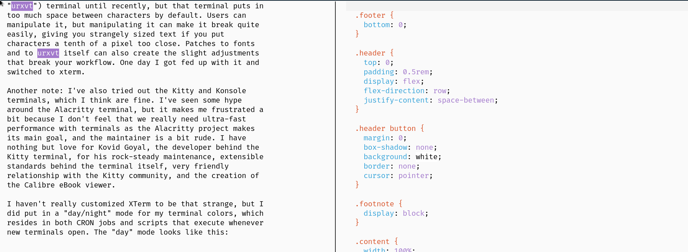
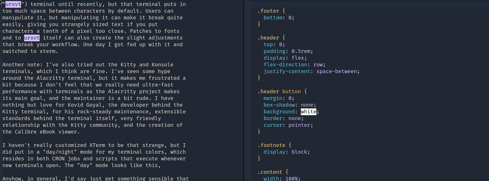
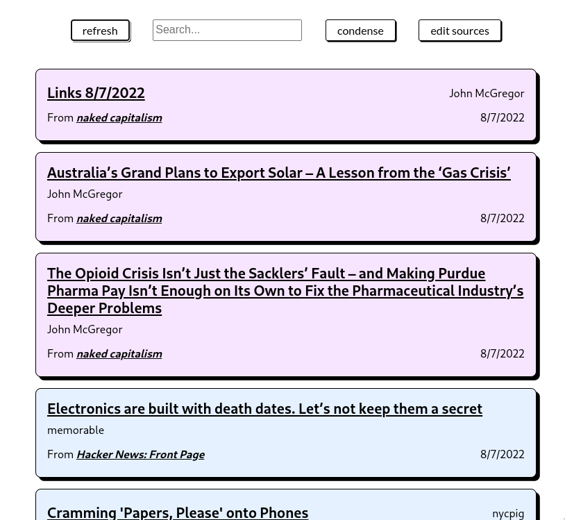
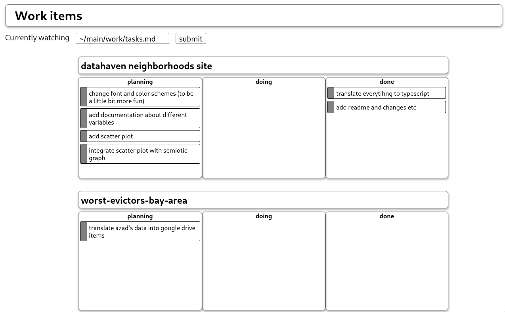

Over the past year and a half or so, I've immersed myself in
the world of Linux and more broadly the process of making
your computer truly your own. This post describes my
experiences and hopefully encourages you to do so as well.

**TLDR**: making your computer your own is hugely fun and
rewarding, both in the sense of personal satisfaction and
growth, and in the sense of time gained back down the road.
The tradeoff between time spent customizing and time gained
through workflow is often not "worth it." But so what if you
waste time on something that is both enjoyable and
meaningful?

Most of the language here is geared towards people who
aren't experts in the Linux world or are fluent in
tech-speak, so I'm a little verbose on explanations. It also
just covers a lot of content in general, and at some point
it will not be useful for you to read a particular section.
Feel free to skip around and use the provided navigation
tools to glean what is useful.

---

## Why?

Why should I (or anyone) care about customizing your own
computer? The answer falls into three categories:

1. **A better world for computing.** There is so much about
   computers that to me is incredibly magical, but much of
   it has been done away with the appropriation of computing
   by a few gigantic companies. I want a world where
   computers are diverse, we are intimately familiar with
   the power under our fingers, and in general where
   computers offer more than corporate prescriptions. I want
   a world where the knowledge behind such devices is open
   and free. So to me that warrants a turn away from
   proprietary operating systems and towards open source and
   experimentation.
2. **Utility and power.** You've probably heard Michio
   Kaku's observation that modern phones (and computers)
   have more power than the machines that put astronauts on
   the moon in 1969. I've heard it a hundred times but my
   amazement from it has not diminished, perhaps a testament
   to how much the power in my laptop has been kept away
   from me, and how much the power has been taken by idle
   processes in my previous Windows machines. I'd like some
   of it back.
3. **Fun.** It really is quite fun to make your own keyboard
   shortcuts or to see thoughts from your head jump to life
   on your computer. This is probably the biggest immediate
   motivator and the reason I set up many of the below
   features.

---

## The operating system

I run Arch Linux, a specific flavor of the family of
GNU/Linux operating systems. For those unaware, "Linux"
refers to the kernel, or the part of my computer handling
things like memory management and file storage. "GNU" refers
to the set of utilities on top of the Linux kernel, like the
GNU C library (or "`glibc`) and the `coreutils` package for
the implementation of commands associated with UNIX
systems.^[There have been some heated debates and arguments
over what the correct term for such a system is. If you do
not know about the history here, my honest recommendation is
to not look it up or really care about such positions, lest
you spiral down a rabbit hole that leaves a distate in your
mouth for people who have otherwise developed a mountain of
free and useful software.]

I started out my Linux journey in September 2021 with
Ubuntu, which I'd recommend to most new Linux users for its
relative ease of use. I'd specifically recommend either
Kubuntu or Pop!\_OS, which are variants of Ubuntu with very
pleasing UIs. Ubuntu was great, although I often grew
frustrated trying to make GNOME and then KDE graphical
settings work how I wanted them to.

I switched to Arch in December 2021. Arch differs from
Ubuntu in being much more minimal by default, not even
including a graphical system (it just leaves you in the
Linux console), many command-line tools, the popular network
managers, addons like Bluetooth, or a web browser. The
upside is that you can make all of these choices yourself,
resulting in (usually) a much more lightweight computer.
Having choice in all of these steps feels good; you feel
like you _own_ your computer and are rewarded with knowledge
of things that were simply hidden from you before. The
downside is that you have to make all of these choices
yourself, often a tedious and time-consuming process. The
initial installation, the period when most of these choices
actually have to be made, is infamous because of this and
somewhat daunting to new users.

After installing Arch three separate times, I'll say that
the first time can be somewhat headache-inducing and
requires meticulous perusal of the ArchWiki's installation
guide, but is a pain quickly forgotten because of the ease
of use of the system after installation. The second and
third times I had to install the system went much more
smoothly and quickly, and I found that I was not really
following directions so much as responding to my instincts
for the system I wanted. Arch Linux can be difficult because
you have to learn a lot, but the magic of this kind of
learning is that you learn once and simply revise and expand
afterward. Developing expertise in this way is a hugely
rewarding feeling.

I played with Gentoo Linux for around three weeks in
March 2022. Gentoo is also fairly minimal in having not much
installed for you, but goes even further than Arch in
requiring you compile all available tools on your own
computer. "Compile" means turning the source code that
someone typed into binary machine code that computers can
run. Large programs like Firefox, the Linux kernel itself,
and VSCode may take hours to compile. This is probably the
most infamous aspect of Gentoo. The upside is that you can
configure all of these yourself, again usually resulting in
a somewhat lighter system by not keeping any features you
don't need. A big example is in the Linux kernel, which is
partly complex for all of the many drivers and architectures
it tries to support. If you only need it to support your own
computer, you end up compiling and using a somewhat simpler
kernel.

After a difficult start, I had a system up and running, but
essential programs like RStudio spent too long compiling and
breaking, and other programs required obscure compilation
flags to work how I expected them to.^[My memory of examples
here fails me at this time.] I decided to revert to Arch and
simply download binaries with the pacman package manager.
Some comments from the developer of the urxvt terminal seem
relevant here:^[His insistence on the GNU/Linux term makes
me laugh a bit here, it seems like a hint of the unimportant
rifts that leave a bad taste in my mouth, as stated in the
above footnote.]

> > I use Gentoo, and I have a problem...
>
> There are two big problems with Gentoo Linux: first, most
> if not all Gentoo systems are completely broken (missing
> or mismatched header files, broken compiler etc. are just
> the tip of the iceberg); secondly, it should be called
> Gentoo GNU/Linux.
>
> For these reasons, it is impossible to support
> rxvt-unicode on Gentoo. Problems appearing on Gentoo
> systems will usually simply be ignored unless they can be
> reproduced on non-Gentoo systems.

In any case, **TLDR the OS**: use something that fits you
and doesn't leave a bad taste in your mouth for both ethical
and technical reasons, but try not to spend too much time
jumping around or "distro hopping." I think Arch is a good
compromise here, as it gave me lots of freedoms and only a
few headaches; I recommend it.

---

## Terminal

I use the xterm terminal. I used the rxvt-unicode (or
"urxvt") terminal until recently, but that terminal puts in
too much space between characters by default. Users can
manipulate it, but manipulating it can make it break quite
easily, giving you strangely sized text if you put
characters a tenth of a pixel too close. Patches to fonts
and to urxvt itself can also create the slight adjustments
that break your workflow. One day I got fed up with it and
switched to xterm.

Another note: I've also tried out the Kitty and Konsole
terminals, which I think are fine. I've seen some hype
around the Alacritty terminal, but it makes me frustrated a
bit because I don't feel that we really need ultra-fast
performance with terminals as the Alacritty project makes
its main goal, and the maintainer is a bit rude. I have
nothing but love for Kovid Goyal, the developer behind the
Kitty terminal, for his rock-steady maintenance, extensible
standards behind the terminal itself, very friendly
relationship with the Kitty community, and the creation of
the Calibre eBook viewer. Using Kitty is a great choice, I
can't remember why I chose to use XTerm, but it was likely
just the option I picked first and then encountered too much
friction to port my configuration.

I haven't really customized XTerm to be that strange, but I
did put in a "day/night" mode for my terminal colors, which
resides in both CRON jobs and scripts that execute whenever
new terminals open. The "day" mode looks like this:



And the "night" mode looks like this:



The colors themselves come from the
[Ayu theme](https://github.com/ayu-theme), with slight
adjustments made by myself for higher contrast on day mode
and softer colors on night mode. I chose Ayu because it is
beautiful and clean, and because it is far more readable
than themes like Solarized that I also find beautiful.^[The
Solarized theme seems to be either loved or hated, and if
anything more often hated. I love Solarized, in both light
and dark flavors.] The code and colors for this
configuration can be found in this
[subfolder in my dotfiles repo](https://gitlab.com/18kimn-personal/utils/-/tree/main/day-night).

Anyhow, in general, I'd say just get/make something sensible
that works for you and doesn't make you feel weird about
supporting it. I happen to use xterm because it's the
standard one for the X Window System, which my computer (and
many others) run.

---

## Desktop environment and window management: "ricing"

Arch doesn't come with a way to display applications or
manage a graphical interface, so you have to pick and use
your own. I picked KDE at first, since that was what I used
on the Ubuntu system I used before.^[KDE stands for "K
Desktop Environment." The "K" used to mean "kool," but the
developers scrapped the meaning and decided to simply call
it K. Everything in the KDE ecosystem begins with K.] KDE is
beautiful, highly customizable, has wonderful and friendly
developers, and gave me an overall amazing experience; I
highly recommend it for both technical and non-technical
users.

The downside of KDE, and arguably all desktop environments,
is that because of their goal of being fully featured and
usable by all, they add much more to your system than you
really need or want. Arch forced me to think a bit more
carefully about what packages and software I have installed
on my system, and realized that I have nearly a hundred
different pieces of software from the KDE ecosystem that I
don't need. Games, printers, extra web browsers and text
editors, audio/video/photo editing -- all things that are
indeed useful at large and make a case for others to use
KDE, but not for me. I wanted a system that gave me none of
these by default, and also allowed me to have a painless
exploration of further tools.^[Some of these are eliminated
from a more minimal KDE setup that Arch provides as a
package. However, I find even that setup has way too many
things that I don't use on a day-to-day basis.]

So I turned to i3 instead. i3 is a window manager, and not a
desktop environment, which means that it provides ways for
your applications to be displayed and managed but does not
provide any extra features necessary to run a working
desktop. i3 does not provide docks or application launchers,
or even a settings interface where you can change basic
things like volume or screen brightness. These must be
installed separately and then attached through i3's keyboard
shortcuts or manually launched on the command line.

This is a long, tedious, and honestly ongoing process. Just
last week I finally got fed up of going to the command line
and connecting to my airpods with `bluetoothctl`, and so I
installed the
[Blueman](https://wiki.archlinux.org/title/Blueman)
bluetooth manager to make this a bit easier. But i3 does
have some of its upsides and allowed me to make some cool
functions I wouldn't have even thought of on other systems.
Here are a few.

- **Startup programs.** I configured i3 to start Spotify, my
  journal (see below), two terminal sessions, and the
  Vivaldi web browser at startup in different tabs. I guess
  you could do something like this in other environments,
  but it fits very nicely into i3's workspace grammar, and
  in my opinion a more ergonomic setup than KDE or GNOME's
  startup features.
- **Keyboard shortcuts.** There are many I made, here are a
  few:
  - Ctrl+b and ctrl+shift+b: Connect or disconnect bluetooth
    to my airpods
  - Alt+j: open my journal
  - Win+Enter and Win+t: open a terminal in my default
    workspace (Win+Enter), or in the last previous workspace
    (Win+t)
  - Ctrl+s: screenshots
  - Win+Number: Navigate to the workspace of the
    corresponding number
  - Win+n: Open a new workspace
- **Simply but pleasing bottom bar.** Using i3-bar, my
  bottom bar has something like this on the left:

  

  You can navigate through different workspaces by clicking
  or by using using the keyboard shortcuts above (I usually
  use the shortcuts).

  My bar usually has something like this on the right:

  

  They change a bit depending on what I have open.

- **Daily updating wallpaper.** Using
  [`feh`](https://wiki.archlinux.org/title/Feh),
  [ImageMagick](https://imagemagick.org), and some more Cron
  jobs and startup scripts, I created a daily-updating
  wallpaper that shows the date, a quote from my
  `leftist-quotes` API, and one of seven fairly calm
  background images.

  

If you have spent any time on the crudely-named subreddit
[r/unixporn](https://www.reddit.com/r/unixporn/wiki/index/)
or other customization-focused communities, you'll know that
this is a fairly moderate amount of customization and
doesn't really have any of the traditional "ricing"
("customizing") goals, that center around a sort of imagined
cyberpunk hacker aesthetic:

- I don't use any terminal UI-based applications, like
  [`spotify-tui`](https://github.com/Rigellute/spotify-tui)
- I don't have transparency, rounded corners, or gaps on any
  of my windows^[Many Redditors use `i3-gaps`, Which is just
  i3 but places gaps between windows, an aesthetic value
  that a surprising amount of Redditors seem to hold. I find
  this gets rid of too much screen space for me, and screen
  space is an asset that I generally find lacking even on my
  decently-sized 15-inch laptop and 23-inch secondary
  monitor.]
- I use Fira Code, which is a standard font in this
  aesthetic and especially valued in this aesthetic for its
  ligatures that transform the aesthetics of certain
  character combinations. But the ligatures that Fira Code
  provides don't work on my terminal (xterm), so I just roll
  without them
- my system font is the ultra-readable Source Sans Pro
  instead of a display or monospaced font
- I have no animations or transitions
- My terminal font size is 15, which seems a click larger
  than other users' sizes according to
  [this post](https://www.reddit.com/r/unixporn/comments/uh9htg/twm_whats_your_ideal_terminal_font_size/)^[It's
  a bit of a stretch to consider small font sizes as part of
  a "hacker/cyberpunk aesthetic." You can throw this point
  out if you'd like.]
- I use only the built-in Linux console for login, instead
  of something like the
  [Plymouth](https://wiki.archlinux.org/title/plymouth)
  startup animation package or even a display manager to
  show a screensaver on the login screen.

I actually tried many of these out but quickly reverted. I'm
not really sure why, as I do consider myself a person that
cares about aesthetics and meaningful design. Perhaps it's
only that my preferences fall a different way. Other people
have different preferences, and the customizations I put in
are terrible for a commercial platform, but I'm very, very
happy with this setup.

---

### Memory usage

The other thing I'll say about i3 and Linux is that by
virtue of running less features and being smaller programs,
they let me use much less memory than I had on my previous
Windows machine. Windows on my machine used about 3-4Gb when
idle; this seems about average from my brief visit to other
people's reports online. My current setup on my computer
uses about 300-400Mb when idle, or about ten times less
memory.

Most often for me this has meant an easier time working with
datasets for in-memory analysis in R. Recently, it's also
meant that my computer is able to smoothly run Docker
containers for a medium-large project I've been contributing
to. Other applications like Chrome, VSCode, Zotero also have
more resources available to them.^[Pretty much any V8- or
Electron-based application goes here: Vivaldi, Spotify
Linux, Obsidian when I used it. Electron is a framework for
making desktop apps as if you're building a website,
combining system functions like files and database
connections with the relatively smooth developer experience
of coding web UIs, using Google's V8 JavaScript engine and
effectively running a Chromium web browser instance for your
app. It's received a lot of criticism since it was released
in 2013, for its security mishaps and memory usage due to
this architecture. Electron apps tend to have high memory
usage partly because the era of valuing conservative and
minimal memory usage has passed, and because JavaScript as a
language and web interfaces require rather large codebases
and engines.] And I'm able to develop many personal
Node-based applications for myself without guilt of memory
usage (see the next section).

I also value this sort of thing (and I suspect most Linux
enthusiasts do as well) because of the principles and
aesthetics it embodies. Computers shouldn't be using any
more resources than they have to by default. They are
powerful machines that can be crippled by too much software;
making effective use of that power means making it available
to users rather than having the underlying system consume
it.

---

## Personal applets

This is kind of a long section because there are a several
things I want to describe. Skip to the next section if you
aren't interested in these personal applets!

A habit I've gotten into that fits into the ongoing theme of
"customizing things for yourself" has been coding small,
usualyl web-based, apps that fill in the gaps of things I
want from a computer. Organized chronologically, they are:

- **An API for leftist quotes**: I actually thought this was
  fun enough to make public and described it
  [in its own post](/projects/leftist-quotes). I run an
  instance on my own computer, at first to avoid any excess
  querying costs from Heroku and now simply because it's
  faster to receive an answer from my laptop than from my
  home server.^[Heroku is a cloud platform for deploying web
  apps and servers. It used to be very popular a few years
  back, but has lost its place a bit compared to similar
  services like AWS, Vercel, Cloudflare Workers, and Deno
  Deploy.]
- **RSS and Atom feed reader**. At the beginning of this
  year I decided to stop spending so much time on Twitter
  and Instagram and follow slightly-longer-form content
  instead, as part of a general push for myself to try to
  focus more and think about things intentionally rather
  than through the firehouse of social media feeds. So I
  made a feed reader that (currently) tracks 38 blogs and
  sites I like. It looks like this:

  

  I originally intended to have the code for this exist
  completely on the front-end, meaning be activated and
  contained inside my web browser that would open the feed
  reader. But because of a security policy called CORS,
  fetching data like feeds from other sites is impossible
  unless the target site specifically allows it, and most
  sites do not. So my solution was to write a server that
  would fetch and store the feeds, and integrate it with the
  code that makes the UI. This was my first solo foray into
  this kind of server-plus-UI (some might call that a
  full-stack web app, some might not) pattern, which repeats
  across the next few projects below.

  Some notable features here: the feeds are fetched
  concurrently through heavy reliance on async code and
  `Promise.allSettled`-based functions. The feeds are passed
  to the UI through the server-sent events web standard,
  which lets items be displayed as soon as a single
  website's code is fetched. On the UI side, there are some
  nice hover effects, each post is colored according to the
  site it came from, and the `localStorage` web API is used
  to cache previously fetched feed entries.

  The last thing I'll say about this is that the server was
  actually my first venture into Rust, and for a while the
  server was a simple Rocket-based Rust application. Rust is
  great and I miss some of its features when writing
  JavaScript or Typescript, for example in requiring
  explicit error handling and in having friendly and
  intuitive reporting of syntax errors. But web server
  frameworks in Rust are a bit underdeveloped in my opinion
  -- and to be honest, they likely will always appear to lag
  a bit behind JavaScript-based web utilities. Rocket and
  Actix Web are very performant frameworks, but (for
  example) Rocket's server-sent events interface didn't let
  me pass in premade streams so that sites could both be
  fetched by the server and passed to the client in an async
  way. So I switched back to Typescript-based NodeJS, where
  development was magically easy if a bit chaotic. I think
  I'll continue using one language (Typescript) for most
  future projects, instead of switching languages for the
  server and frontend code.

- **Task boards.** I have an ongoing tasklist always kept in
  my journal entries, but in one particularly busy period I
  found I needed something slightly more complex. So I came
  up with a UI for task managing, or "kanban" boards:

  

  A "kanban board" in American software engineering
  colloquial usage refers to a rectangle holding three (or
  more) columns.^[I feel strange about the appropriation of
  the Japanese term from its history and how it is swept up
  into American hype trains. In this spirit I'll just refer
  to them as "task boards."] The three columns can be named
  many different things, but from right to left are used for
  tasks waiting to be worked on, tasks currently being
  worked on, and completed tasks. A board like this helps
  firstly with keeping track of necessary tasks, but also
  helps prioritize which tasks to tackle, reminds one of
  accomplishments and progress, and encourages one to take
  on only a few tasks at a time.

  I expanded on this a bit with two dimensions. The first
  dimension lies in having multiple boards, where each board
  represents a single project. At this point in life I work
  on multiple projects at a time, even within a single job
  or organization, so keeping track of tasks for each of
  them has been helpful for me. The second layer in the same
  tune is separating groups of these boards into
  collections. I have just two collections right now, one
  for personal projects and one for work, but I am planning
  a few personal projects that might require their own
  collections and I'll also have to make more for my last
  semester of college and grad school applications that
  start soon.

  I'm pretty happy with this! I've implemented some
  quality-of-life features like drag-and-drop, animations
  and transitions, loading indicators, error messages,
  keyboard navigation, and (to me) coolest of all, a
  markdown-tasklist converter and sync system. In other
  words, all of my tasklist collections are synced with
  plaintext, syntactically valid Markdown documents. The
  tasklist collection in the above screenshot looks like
  this as Markdown (scroll horizontally to view overflowing
  content):^["Syntactically valid" Markdown plus YAML
  metadata. The CommonMark specification for Markdown, which
  is the closest thing we have for a canonical ruleset for
  Markdown, leaves out many features developers often want.
  The only one I've used in this setup is YAML headers that
  add metadata to these markdown files.]

  ```
  ---
  name: Work items
  ---

  ## datahaven neighborhoods site

  | planning                                                    | doing | done                               |
  | ----------------------------------------------------------- | ----- | ---------------------------------- |
  | change font and color schemes (to be a little bit more fun) |       | translate everytihng to typescript |
  | add documentation about different variables                 |       | add readme and changes etc         |
  | add scatter plot&nbsp;                                      |       |                                    |
  | integrate scatter plot with semiotic graph                  |       |                                    |

  ---

  ## worst-evictors-bay-area

  | planning                                      | doing | done |
  | --------------------------------------------- | ----- | ---- |
  | translate azad's data into google drive items |       |      |

  ```

  This turned out to be much easier than I thought, praise
  be to the beautifully simple syntax of Markdown and the
  magic of API routes in SvelteKit.^[SvelteKit is a web
  development environment built on top of the Svelte
  framework. I love it for many reasons, including managing
  the state of applications very nicely and lending itself
  to easy styling.] I was even able to put in debouncing for
  the updates to these documents, used the `localStorage`
  API to remember across tab sessions which collections are
  in which documents, and used the Prettier library in
  JavaScript to automagically format Markdown
  tables.^["Debouncing" refers to having an action happen a
  bit later than its trigger. In this scenario, I could have
  the documents updated whenever I make a change, but I put
  in a debouncer to have the document updater wait for a
  little bit after I stop making changes to the UI to update
  the underlying documents. This lets me saving more than
  necessary.]

  There are still some rough edges, like some layout shifts
  when I drag tasks, or putting in a "confirm" feature for
  deletions of tasks and boards, but this is useful and
  satisfying enough to me that I use it every day, for
  nearly all of my tasks. And I've become more organized as
  a result!

- **Bookmark manager.** For a brief stint last year, I
  exclusively used the Beaker web browser, which uses the
  DAT and Hypercore protocols to enable access to
  peer-to-peer-hosted websites. It was quite fun! But the
  project itself is no longer actively developed, I believe,
  and the browser is not fully featured. My biggest gripe
  was with the lack of bookmarks, so I coded up a bookmarks
  manager that was meant to emulate the structure of a file
  explorer, with "folders" existing for groups of bookmarks
  or other folders. This was my first time using Vue and
  coding a recursive component, so that was quite fun if
  somewhat headache-inducing. The preview is ommitted here
  because it is under a rewrite, and I also don't use it
  anymore as I use the Vivaldi browser for day-to-day use.
- **Notes graph**. This also has a
  [its own page](/projects/notes)! I made a d3 force network
  graph to visualize how my files link together. It's kind
  of a work in progress, to be honest.

- **Homepage**. Each of the above processes are deployed on
  separate ports on my computer, and daemonized through
  pm2.^["Daemonize" means that the process is set to start
  up every time I start my computer and run in the
  background. Pm2 is just a JavaScript-based application
  that lets you do this more easily than other systems like
  the i3 startup hook or systemd on Linux.] They are
  connected by a single repository I call `homepage`, which
  includes the other projects as Git submodules.^[Git is a
  version control system, which means it tracks and records
  changes to your files. Submodules in Git are projects
  managed by Git that belong in other Git projects and are
  optimized as such.] The code for `homepage` simply
  displays them on a single screen, has a sidebar to
  navigate between them, and reaches out to the
  corresponding port on `localhost` whenever a server
  interaction is needed.

  This lets me host all of the above applets on a single
  "site." The cherry on top is a feature in my web browser,
  Vivaldi,^[I'm sure other browsers have this too, though]
  that opens this site whenever I open a new tab or open a
  fresh browser instnace, effectively making this site my
  homepage.

  Pretty neat!

The last thing I'll say about the projects is that they
likely have not contributed to my productivity as much as
the time I have spent developing them. If you're really into
productivity or are looking for ways to optimize your
workflow or something like that, these aren't for you.
They're really just fun projects that make me happy building
and using!

---

## Writing

At the beginning of college, I wrote and took notes by hand.
Wanting to be more organized and work in a more portable
format, I used Google Docs. Wanting to be a bit more
principled about that, I used Obsidian and wrote in
Markdown.

Obsidian is a great note-taking app, and it fits well for
people who like Notion (another great app) but take pride in
any of slightly more technical prowess, a locally-stored
note repository, or the Zettelkasten note-taking
system.^[The Zettelkasten system is a somewhat popular style
of taking notes, that believes in notes as small documents
with identifiers that can link to and be linked from other
notes. People get pretty excited about it, I encourage you
to look it up if you have any interest.] It also has a very
developed plugin interface and correspondingly rich
ecosystem of plugins, and also has ways for users to style
or customize their own instances. In general, Obsidian has a
lot of thought put into its design, from its philosophy to
the UI aesthetics and software architecture. Because of
this, no matter how much customization you add, you still
have a very well-built tool at its core. I highly recommend
checking it out if you're interested in it, I think the
developers (Erica Xu and Shida Li) are creating something
fantastic and deserve all of the support they have received.

However, Obsidian works best when you have solely a vault of
plaintext notes, and not if (as in my case) you want to use
it as a general purpose plaintext editor. My notes were also
often taken alongside code projects that had directories
like `node_modules`, `__pycache__`, or `renv` that held
dependency information for the project. These directories
tend to be very large, and Obsidian provides no way to
ignore them and simply indexes every file it sees. This
resulted in long startup times and awkward use of the
built-in graph viewer. Rather than simply adjust my
note-taking patterns, I felt again that I'd rather go for
something that I could tailor to my needs and would be a bit
more performant.^[A secondary reason I switched was because
Obsidian is still closed-source. The developers are trying
to build a viable business and feel that diverting energy of
their two-person team towards documentation and maintenance
of an open source project is not reasonable. See more at
their co-lead developer's comment on the matter:
https://forum.obsidian.md/t/open-sourcing-of-obsidian/1515/11.
I have tons of respect for them and don't want to criticize
this at all, because they are not the tech giants that
withhold knowledge and software through restrictive
licenses. But a small reason I switched was because it's
still personally reassuring to have and use completely
public utilities.] For me, that was Neovim.^[Just to avoid
any disambiguities, Vim-based syntax is actually also
available inside Vim, making for a few amazing Tweets (see
https://twitter.com/chigbarg/status/1448817993329250334).]

If you've never used Vim or Neovim (hereafter when I say
"Vim," I mean the Neovim successor), you are blessed. They
are an old-school terminal-based text editor that rely on
excessive use of obtuse keyboard mappings and little-to-no
mouse control. "j" means "go down," "A" means "begin
inserting at the end of the line", "v" means "begin
selecting," and so on. The upside is that you generally gain
a bit of speed in writing, as it does take a small amount of
time to reach for the mouse and navigate using its fluid
motion. I've also always found it awkward to navigate with
laptop trackpads, which is a bit of an unavoidable scenario
sometimes. Relying on the keyboard for all writing actions
from copy and paste to navigating with the home row results
in a more ergonomic workflow.

My writing pattern through Vim generally falls into two
groups: long-form writing and short notes. For longer form
writing, it varies case by case, but generally I like to
write in markdown files in a single folder organized by
chapter or topic heading, then use Pandoc-based shell script
to turns my markdown files into a single nice PDF. Often
this requires manual configuration of citations and citation
styles, plugins for when I'd like to split a paper into
multiple files, and so on. This is somewhat tedious and
breaks quite easily, so I'm strongly considering making a
permanent move to the new [Quarto](https://quarto.org)
scientific writing system, created by RStudio.^[And no, I
don't care that they're called Posit now and want us to
recognize all of their labor and contributions towards
cross-language and cross-format connections. They're RStudio
in my heart.]

For shorter form notes, I navigate to a directory where I
have around ~170 markdown files so far using the shell alias
`cdn` (`cd` to my `n`otes directory). Then I type
`note a-new-thought`, or whatever else I'd like to call the
new file, and hit Enter. A Python script I wrote
instantiates a file and Neovim opens it, letting me see:

```
---
created: 2022-08-07
modified: [2022-08-07]
title:
tags: []
author: Nathan
---

```

And I continue writing my thought below. This metadata is
useful for programmatic access, for example the "visualizing
my brain" project that I noted above or indexing into the
list on this blog, see the
[corresponding index file](/thoughts). I have some Vim
shortcuts that help me put in tags in this metadata section.
Though I don't quite have a Zettelkasten system yet, I do
believe in the usefulness of linking notes together, so I
also use some functions to help me insert links. These
helpers are written on top of the
[fzf.vim](https://github.com/junegunn/fzf.vim)
utility.^["fzf" stands for "fuzzy finder". fzf.vim is the
Vim plugin for fzf.] The developer of fzf.vim,
[Junegunn Choi](https://github.com/junegunn), has developed
many useful open-source tools including and beyond fzf, and
I encourage you to check out their work and/or sponsor them
if you are able (link is on their name).^[I really don't
know how to say this, but some of the projects Choi has made
are... beautiful? Inspiring? Just so well-made, from the
docs to design. They are inspirations and encouragements to
programmers everywhere.]

The other unspoken giant in this equation is the fact that
all of my writing takes place in a terminal, and the
terminal+Neovim combination in my view is very quick and
lightweight compared to other editors like Notion, Google
Docs, Microsoft Word, or Obsidian. I can have a thought and
start recording it in less than half a second, a luxury that
more graphically pleasing text editors don't offer.

All of this being said, after some use with Vim and my
current setup I believe it's one of those things the
community of Vim and Linux users do religiously for its own
sake, and neither for the most enthusiastic Vim users nor
for non-technical laypeople does it either provide great
returns nor have much relevance to our workflow priorities.
So I'd recommend you just stick with your regular tool for
notetaking, whether it be Google Docs, Notion, a pen and
paper, or anything else. It's more important to take notes
than to work on your note system.^[I should take my own
advice.]

## Journaling

Journaling is something I do every day, and have made enough
features with it to warrant its own section separate from
the general writing section. I highly recommend journaling
of any kind -- I think any form of self-reflection and
introspection is good, any form of writing is good, any form
of recording yourself and who you are is healthy and good.

At startup, my computer opens up the journal entry for the
corresponding day. Because I often write about fairly
private things, I've placed my journal behind a vault that
is encrypted with
[EncFS](https://wiki.archlinux.org/title/EncFS) and must be
manually unlocked by myself. I've connected this to
[fprint](https://wiki.archlinux.org/title/Fprint) to unlock
the vault with the fingerprint sensor on my laptop.

If the journal entry already exists for the day, the Python
script handling my journal entries simply returns the
filename to Neovim, which opens the file. If it does not,
the Python script instantiates it with a template that looks
something like this:

```md
---
date: 2022/8/07
---

## what i am doing today

---

### ongoing tasks

---

## how i am feeling today

---

(a leftist quote is inserted here)

---

## listening to
```

The Python script also fills in three things:

- **Tasks for the day.** Tasks in markdown look like this:^[
  Task syntax in markdown is not part of CommonMark, but it
  is part of Github-flavored Markdown (GFM), and is a pretty
  useful syntax in my opinion. So despite wanting to
  generally stick to CommonMark, I use task syntax in my
  journal entries.]

  ```
  - [ ] this is an uncompleted task
  - [x] this is a completed task
  ```

  The Python script checks for unfilled tasks from the
  previous day under the `## what i am doing today` heading
  and places them in the same section for the current day.
  It also checks for any tasks, even completed tasks, from
  the `## ongoing tasks` heading and places them in the same
  section of the current day, unfilled.

  The first kind of task would be a discrete, usually
  non-reoccurring task that I meant to complete the previous
  day but did not, for example responding to an email or
  finishing an assignment. The second kind is a task that I
  must remember to do every day, for example studying some
  vocab words as I prepare for the GRE.

  These tasks are sort of an informal and incomplete list,
  usually having around five to seven tasks of each kind.
  Other tasks, for example project-specific items, I manage
  through the aforementioned task board system.

  To give credit where it is due, this feature was inspired
  by the
  [Rollover Daily Todos](https://github.com/shichongrui/obsidian-rollover-daily-todos)
  plugin from Obsidian, which I used last year. It is a
  fantastic idea and I have a lot of thanks for Matthew
  Sessions, who developed it.

- **A leftist quote** is also fetched from the
  locally-running instance of my leftist quotes API, as
  described above. This is formatted into markdown-friendly
  syntax and placed into the journal entry.
- **"Recently listened to" songs.** I query the Spotify Web
  API for five random songs out of the fifty I've most
  recently listened to. This is formatted into
  markdown-friendly text. An example:

  ```md
  - _Nocturnal animals (Feat. Zior Park)_ by **ZICO**
  - _Painful_ by **EDEN**
  - _see you soon_ by **OuiOui**
  - _Sweet Talk (Feat. Summer Soul)_ by **Lym en**
  - _Salty_ by **THE BOYZ**
  - _kickkick_ by **DAYBREAK**
  ```

  This is placed in the `## listening to` section.

Because the journal entry has its own workspace tab in i3, I
keep it open and fill it out as I go throughout my day. It's
a super gratifying thing to do, very satisfying to look back
on, and in general a very healthy and positive way to
self-reflect. The system has actually been relatively easy
to implement out of the other applets and functions I've
described here. Journaling is also something that I do every
day and is pretty important emotionally to me, and it likely
could be for you as well. So for all of these reasons, I'd
actually recommend thinking about something like this. You
can write a Python script like I did, or perhaps you could
use Obsidian's Rollover Daily Todo plugin with perhaps the
templates function to make your own journaling system. You
could even type or handwrite a template manually, or not use
a strict template at all -- I just believe that it's good to
journal and to work a bit on how you journal so that it
makes you happy and the habit sustainable.

---

## The end and more

And that's it! Well, sort of, the other stuff I have I make
privately for security and privacy reasons. There's also
some stuff in development that didn't make it on here.
