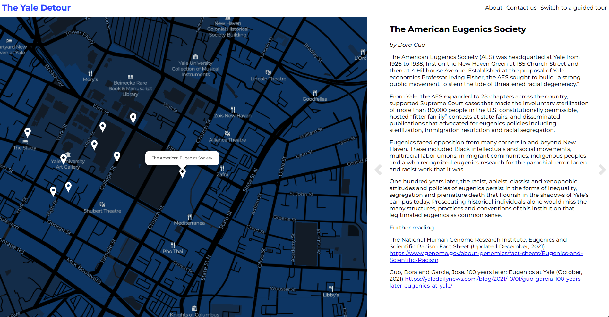

<a class="caption" href="https://yale-detour.org" target="_blank">
 Click to view the site.
</a>

## About

For the past few months I've been working with some friends on
a project we've been calling the Yale Detour. The project is an
attempt to think about how Yale’s history as a colonial
institution remains embedded in its architecture and landscape
in the present-day, and to highlight sites where Yale students
and New Haven residents have changed the course of the
university’s history through remarkable moments of struggle.
This project presents this through an interactive map.

This project is adapted from an in-person tour developed by
Esul Burton and Janis Jin in Summer 2019 for the Cultural
Connections pre-orientation program at Yale. At that time, the
project was called the "Yale Critical History Tour." Since
then, the project has expanded somewhat in scope due to work
from students in Professor Talya Zemach-Bersin's Fall 2020
interation of the seminar Education and Empire. Editors Amy Kim
and Jose Garcia, along with Mia Coates, Mona Mahadevan, Blanca
Tallaj, Natalie Troy, Juma Sei, and Sasha Lee, created a zine
titled "The Yale Detour." This zine can be seen on Flipsnack
[here](https://www.flipsnack.com/yaledetours/yale-detours.html).

These two tours (or "detours") were developed separately, but
they have very similar goals. These histories pushed back
against the cheery versions of Yale history spread by vetted
and trained student employees on Yale's official tour guides.
Rather than being remnants or artifacts of the past, these
histories are ongoing ones that Yale refuses to denounce and
even enthusiastically carries forth, from the takeover and
management of the "Shops on Broadway" (a Yale designation) to
the funding and namesake of the Schwarzman Center that opened
in 2021. These histories aren't lessons from Yale's past that
we can learn from, but a story of an ongoing struggle; a
colonial history of the present. Esul and Janis, joined by
Collin Bentley, began developing a interactive, digital version
of the Yale Critical History Tour in 2020. This digital version
was eventually continued by myself (Nathan Kim), Resty Fufunan,
Dora Guo, Amy Kim, and Jose Garcia as the Yale Detour.

## Implementation

My main contribution to this project was building out the
technical architecture used for the site.^[I also served as a
sort of general coordinator, but that process was informal and
disorganized enough so I will not elaborate on it here.] Janis
suggested to me the possibility of continuing the work she,
Esul, and Collin had begun. I was first a bit unsure because I
had very little experience with web development at the time,
but enthusiastically accepted after a summer of working with
the Anti-Eviction Mapping Project and learning React and other
web technologies while doing so.

The initial site was built using Mapbox GL for the map
component, React as its component system, Netlify as a content
management system, and Bootstrap as a styling system. This was
thanks to the work of Collin Bentley. That worked really well,
and sporadically throughout Fall 2021 I expanded on that and
focused on making the map zoom work well, adjusting the map
style, making the carousel component work correctly, and other
features.

At the end of the semester, I had learned quite a bit more
about web development in general and more importantly had
cemented a few principles that I felt made for more sustainable
web development, both for the developer and for the end user.
So I rewrote the site to use Leaflet as the map component,
using Svelte as the component architecture, and writing sites
in raw markdown with the assistance of Gitlab's wiki system.
With wireframes contributed by our designer Dora Guo, I also
redid our styling system to not depend on any third
party-dependencies. I felt that this was more minimal, offered
more control to the developer, cut down the bundle size from
~300kB to ~30kB with only a single dependency (leaflet), and
overall just felt like the correct solution. More important
than those sort of quality-of-life and performance benefits,
this structure offers _ownership_ to the builders of the Yale
Detour, and that was the most important ideal to me.

More details can be found on our
[Gitlab wiki](https://gitlab.com/18kimn/yale-detour/-/wikis/home),
which contains details about our technical process and
contributor guidelines.
